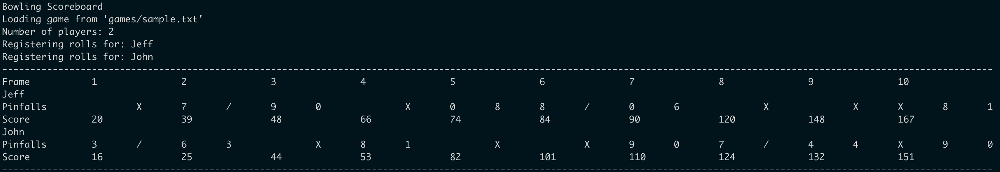

# Bowling Scorer

It outputs a bowling score table by processing a text file containing list of player rolls.
This project was built to gool Object Oriented Programming practices in Ruby. 



### Dependencies
- Ruby 2.3.0+
- Bundler 1.17.2+
- Rubygems 3.0.1
- RSpec 3.8 (unit tests)
- Simplecov (coverage)

### Installation
Bunde all dependencies.
```sh
$ cd bowling-scorer
$ bundle install
```

### Usage

In the root path, execute `generate_board.rb` and pass the path to the input file, e.g.
```sh
$ ruby generate_board.rb -i games/sample.txt
```
In order to guarantee readability, increase your terminal's width.

### Input File
Plain text files `.txt` with lines following the format `<player_id num_of_bins>`.

```
player_1 3
player_1 7
player_2 10
player_1 F
player_1 4
player_2 0
player_2 7
...
```
**Notes:** 
- The file must have one or more players completing 10 frames in total.
- `F` stands for fault
- The project folder has sample files inside the `games` folder:

### Run unit tests
All suite:
  ```
  $ rspec
  ```
Specific file:
  ```
  $ rspec spec/single_scorer_spec.rb
  ```
For a specific test add `:line_of_code` to the specific test file.
  ```
  $ rspec spec/single_scorer_spec.rb:9
  ```
  Add the flag `-f d ` or `--format documentation` for descriptive output.
  
### Code coverage
  After running all tests, a `coverage` folder is created in the root of the project. Open
  `index.html` in your browser to see the results.

